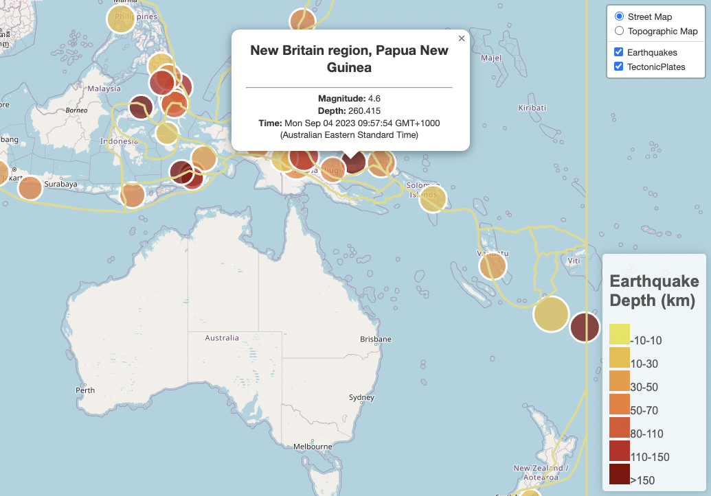

# Leaflet Challenge

Placeholder!

Created and submitted for an assignment for Monash University Data Analytics Boot Camp (September 2023).

## Table of Contents

- [General info](#general-info)
- [Technologies](#technologies)
- [Screenshot](#screenshot)
- [Code example](#code-example)
- [References](#references)

## General info

### logic.js

- placeholder


### index.html

- placeholder.

### style.css

- placeholder.


## Technologies

Project created and run using:

- JavaScript 116.0.0.0
- Plotly 5.9.0
- Leaflet ver:
- Visual Studio Code 1.79.2

## Screenshot

#### Earthquake Map



## Code example

```java
// Code Snippet from app.js
////////////////////////////////////////////////////////////// 

// placeholder
```

## References

- placeholder.

  - ```javascript
    //placeholder 
    ```

- Code, in general, was adapted from Monash University Data Analytics Boot Camp 2023 course learning material.

Created and written by Samuel Palframan - September 2023.
