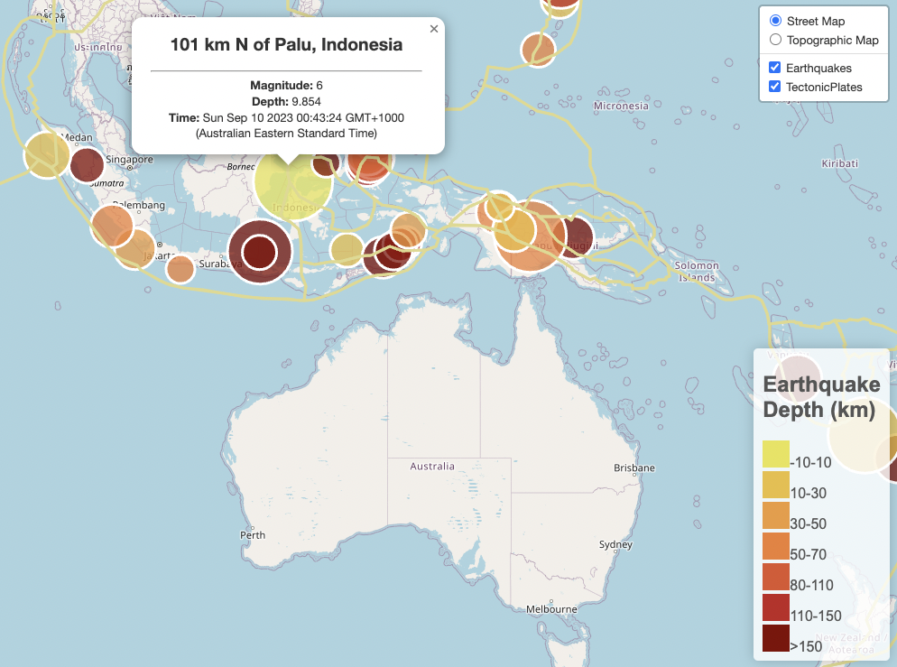

# Leaflet Challenge

Fetches global Earthquake and Tectonic Plate GeoJSON data and plots the data on an interactive map using Leaflet!

Created and submitted for an assignment for Monash University Data Analytics Boot Camp (September 2023).

## Table of Contents

- [General info](#general-info)
- [Technologies](#technologies)
- [Screenshot](#screenshot)
- [Code example](#code-example)
- [References](#references)

## General info

### logic.js

- Fetches global Earthquake GeoJSON data containing data from the last 7 days.
- Fetches Tectonic Plate geospatial data.
- Plots Earthquake Markers and Tectonic Plate boundaries on an interactive Map using Leaflet:
  - Marker size corresponds to Earthquake Magnitude.
  - Marker colour corresponds to Earthquake Depth.
  - Yellow lines designate Tectonic Plate boundaries.


### index.html

- Interactive map HTML file.

### style.css

- Contains style properties for index.html.


## Technologies

Project created and run using:

- JavaScript 116.0.0.0
- Plotly 5.9.0
- Leaflet 1.9.4
- Visual Studio Code 1.82.0

## Screenshot

#### Earthquake Map



## Code example

```javascript
// Code Snippet from logic.js
////////////////////////////////////////////////////////////// 

////////// FETCH JSON DATA & PLOT LEAFLET MAP /////////
//////////////////////////////////////////////////////////////

// Fetch Earthquake Data
d3.json(eqURL).then(function (data) {
    let features = data.features;
    console.log("Data: ", features[0]);

    // Create Features Object for Easy Access 
    let features_object = features.map(feature => ({
        'id': feature.id,
        'latitude': feature.geometry.coordinates[1],
        'longitude': feature.geometry.coordinates[0],
        'coordinates': [feature.geometry.coordinates[1], feature.geometry.coordinates[0]],
        'depth': feature.geometry.coordinates[2],
        'magnitude': feature.properties.mag,
        'place': feature.properties.place,
        'title': feature.properties.title,
        'time': feature.properties.time
    }));

    // Loop through Earthquake Object and create Marker for each Earthquake Object.
    for (let i = 0; i < features_object.length; i++) {
        eqMarkers.push(
            L.circle(features_object[i].coordinates, {
                fillOpacity: 0.75,
                color: "white",
                fillColor: markerColor(features_object[i].depth),
                radius: markerSize(features_object[i].magnitude)
                }).bindPopup(`<h2>${features_object[i].place}</h2> <hr>\
                <body><b>Magnitude:</b> ${features_object[i].magnitude}</body><br>\
                <body><b>Depth:</b> ${features_object[i].depth}</body><br>\
                <body><b>Time:</b> ${new Date(features_object[i].time)}</body>`))}
```

## References

- Create Legend for Leaflet Plot:

  - Code adapted with modifications from: https://stackoverflow.com/questions/37701211/custom-legend-image-as-legend-in-leaflet-map

  - ```javascript
    // Create Legend
    legend.onAdd = function (map) {
        let div = L.DomUtil.create('div', 'info legend'),
            labels = ["-10-10","10-30","30-50","50-70","80-110","110-150",">150"];
            div.innerHTML = "<h2>Earthquake<br>Depth (km)</h2>";
        // Loop through Labels and generate coloured square for each Label
        for (let i = 0; i < labels.length; i++) {
            div.innerHTML += "<li style=\"background-color: " + colors[i] + "\"></li>" + labels[i] + "<ul>" + "</ul>";
        };
        return div;
    };
    ```

- Code, in general, was adapted from Monash University Data Analytics Boot Camp 2023 course learning material.

Created and written by Samuel Palframan - September 2023.
